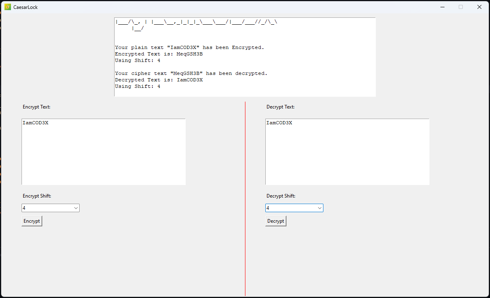

# CipherShift

CipherShift is a simple GUI-based tool that uses the Caesar Cipher algorithm to encrypt and decrypt text. The Caesar Cipher is one of the oldest and simplest encryption techniques where each letter in the plaintext is shifted a certain number of places down or up the alphabet.

## Features

- Encrypt text using the Caesar Cipher algorithm
- Decrypt text encrypted with the Caesar Cipher algorithm
- User-friendly graphical interface
- Input validation to ensure proper use

## How It Works

The Caesar Cipher works by shifting the letters of the alphabet by a fixed number of positions. For example, with a shift of 3:

- A becomes D
- B becomes E
- C becomes F
- ...
- X becomes A
- Y becomes B
- Z becomes C

To decrypt the text, the process is reversed by shifting the letters back by the same number of positions.

## Installation

Clone the repository from GitHub:

```bash
git clone https://github.com/yourusername/ciphershift.git
```

Navigate to the project directory:

```bash
cd ciphershift
```

Install the required dependencies:

```bash
pip install -r requirements.txt
```

## Usage

Run the application:

```bash
python ciphershift.py
```

### Encrypt Text

1. Enter the text you want to encrypt in the input field.
2. Enter the shift value (a positive integer).
3. Click the "Encrypt" button.
4. The encrypted text will be displayed.

### Decrypt Text

1. Enter the encrypted text in the input field.
2. Enter the shift value used during encryption.
3. Click the "Decrypt" button.
4. The decrypted text will be displayed.

## Screenshots



## Contributing

Contributions are welcome! Please fork the repository and submit a pull request with your changes.

## License

This project is licensed under the MIT License.

## Contact

For any questions or suggestions, please contact Sourabh at [sourabh.panchal28@gmail.com](mailto:sourabh.panchal28@gmail.com).
